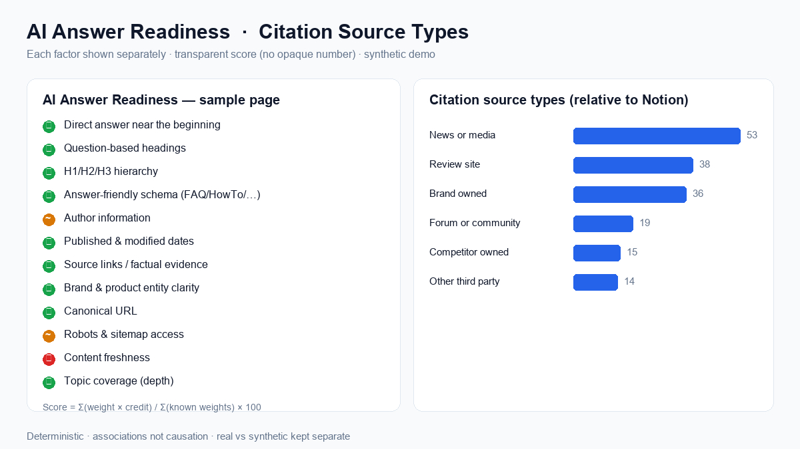

# 🔎 AI Visibility Explorer

Measure how a brand shows up across **AI-powered search answers** — how often it is
mentioned, how it compares with competitors, which sources get cited, where the content
gaps are, and **what to do next** — then export a plain-language readout a marketing or
customer-success team can act on.

> **Deterministic, offline-first, and free to run. No paid APIs required.**
> The bundled demo data is **synthetic** (generated by a script) and is clearly labelled
> as such — it is **not** real output from ChatGPT, Claude, Gemini, Perplexity, or any
> other platform.


---

## What's new (upgrade)

The original MVP measured visibility, competitors, citations, and produced a readout.
This upgrade adds five capabilities on top — without changing the original workflow, tests,
metric definitions, synthetic-data labels, or responsible-use protections:

1. **Real Benchmark Mode** — label every batch of responses as **Real**, **User Collected**,
   or **Synthetic**, group them into named benchmarks with collection metadata, and keep real
   and synthetic results **strictly separated** in every chart, filter, and export.
2. **Entity & Narrative Analysis** — deterministic, editable extraction of how AI answers
   describe each brand (category, products, features, personas, strengths, weaknesses,
   pricing/positioning, and competitors named alongside), plus common descriptors, conflicting
   descriptions, missing attributes, and narrative consistency across platforms and runs.
3. **Citation Quality & Opportunities** — classify each cited source (brand-owned,
   competitor-owned, review site, forum/community, news/media, documentation, social, other),
   with diversity, concentration, brand-vs-third-party share, top source types, and grounded
   citation *opportunities*.
4. **Content Action Briefs** — for every content gap, a ready-to-use, grounded brief (persona,
   journey stage, topic, questions, format, title, headings, schema, evidence, source
   opportunities).
5. **AI Answer Readiness Audit** — the page audit now checks 12 answer-readiness factors,
   each shown separately, with an **optional, fully transparent** score (exact formula, weights,
   and per-factor points — never an opaque number).



---

## The problem

People increasingly ask AI assistants ("what's the best project management tool?")
instead of scrolling a search-results page. The AI answers a handful of brands, often
recommends one, and sometimes cites a few websites. For a brand, **being named — early,
and favourably — in those answers is the new visibility**. But that visibility is:

- **hard to see** (there's no ranking report),
- **noisy** (the same prompt can return different brands on different runs), and
- **easy to over-interpret** (one run is not a trend).

AI Visibility Explorer turns a set of AI responses into transparent, defensible metrics —
and is deliberately honest about their limits.

## Why AI-search visibility matters

- AI answers compress a whole results page into a short list. **Inclusion and order matter
  more than ever.**
- Third-party sources (review sites, roundups, forums) frequently shape which brands get
  recommended — so influence isn't only about your own website.
- Visibility shifts as models update and as content changes. **Measuring it repeatably**
  lets a team see whether their content work is paying off.

## Intended users

- **Marketing / SEO / content teams** wanting to understand and improve AI-search presence.
- **Customer-success / analyst teams** at a company like Scrunch producing customer-facing
  readouts.
- **Anyone** evaluating brand visibility across AI platforms who needs transparent,
  explainable numbers rather than a black box.

---

## Product workflow

1. **Create a project** — name it, set the industry.
2. **Add brands** (yours + competitors), with optional **aliases** (e.g. "Monday" → "Monday.com").
3. **Add prompts** and classify them by category, topic, persona, journey stage, and
   brand/non-brand.
4. **Add AI responses** — paste one at a time or **upload a CSV**. Choose the platform label
   and experiment date.
5. **Run extraction** — deterministic brand-mention + citation extraction (correct results by hand if needed).
6. **Explore the dashboard** — filter by brand, platform, category, topic, persona, stage, date.
7. **Read the customer readout** — a grounded, plain-language summary, exportable to Markdown.
8. **Check limitations** — a permanent section on confidence and caveats.

Optional: **Page Audit** inspects the public technical traits of cited pages (title, headings,
schema, freshness) — presented strictly as *associations, not causes*.

---

## Measurement framework & metric definitions

Every metric is a small, pure Python function in [`src/metrics.py`](src/metrics.py) with a
plain-language definition surfaced as a tooltip in the app (definitions are **never hidden**).

| # | Metric | Definition |
|---|--------|------------|
| 1 | **Brand mention rate** | Share of responses that mention a brand at least once. |
| 2 | **Share of voice** | A brand's mentions ÷ total mentions of all tracked brands. |
| 3 | **First mention share** | Among responses naming any tracked brand, the share where this brand appears first. |
| 4 | **Recommendation rate** | Share of responses that actively recommend a brand (transparent cue-word heuristic). |
| 5 | **Citation rate** | Share of responses that include at least one source URL. |
| 6 | **Source domain share** | For each cited website, its share of all citations. |
| 7 | **Prompt category performance** | Brand mention rate broken down by prompt category. |
| 8 | **Persona performance** | Brand mention rate broken down by target persona. |
| 9 | **Platform comparison** | Mention rate / share of voice by AI platform. |
| 10 | **Competitor visibility** | Leaderboard of mention rate + share of voice across brands. |
| 11 | **Content coverage gaps** | Topics where the focal brand trails the best competitor. |
| 12 | **Response consistency** | Stability across repeated runs of the same prompt. |

**Response consistency** uses simple, explainable measures — not heavy statistics a small
sample can't support:

- **Brand overlap** — mean pairwise Jaccard of the *sets of brands* mentioned across runs.
- **Recommendation agreement** — mean pairwise Jaccard of the *recommended* brand sets.
- **Citation domain overlap** — mean pairwise Jaccard of cited-domain sets.
- **Mention count variation** — coefficient of variation of total mentions per run.

### New metrics & definitions (upgrade)

| Metric | Definition |
|--------|------------|
| **Narrative consistency** | Mean pairwise Jaccard overlap of a brand's descriptor sets (strengths + features + positioning) across its runs. 1.0 = described identically every time. |
| **Common descriptors** | Descriptors used in ≥ a threshold share of a brand's responses. |
| **Conflicting descriptions** | Both members of an opposing descriptor pair (e.g. *Affordable* vs *Expensive*) appear across a brand's responses. |
| **Attribute coverage** | Share of a brand's responses in which each entity attribute (category, products, …) is populated — low coverage flags missing/inconsistent attributes. |
| **Citation diversity** | Unique cited domains ÷ total citations (plus Shannon evenness, 0–1). |
| **Citation concentration** | Herfindahl index (HHI) of domain shares, plus top-1 / top-3 domain share. |
| **Source type share** | Share of citations by transparent source type (brand-owned, competitor-owned, review, forum, news, docs, social, other). |
| **Citation opportunity gap** | For a third-party domain: responses citing it that mention a competitor minus those mentioning the focal brand. Positive = cited alongside competitors more than you. |

### AI Answer Readiness — scoring definition (fully transparent)

The readiness audit reports **12 factors separately** (direct answer up top, question-based
headings, H1/H2/H3 hierarchy, answer-friendly schema, author info, published & modified dates,
source links, brand/product entity clarity, canonical URL, robots & sitemap, freshness, topic
coverage). Each factor gets a status: **pass / partial / fail / unknown**.

The **optional** summary score is never opaque — the app always shows the exact formula, weights,
and per-factor points:

```
score = Σ(weight × credit) / Σ(weight of known factors) × 100
credit: pass = 1.0, partial = 0.5, fail = 0.0
unknown factors are EXCLUDED from both numerator and denominator
```

Weights (sum = 100): direct answer 12, question headings 10, hierarchy 10, schema 12,
author 6, dates 8, source links 10, entity clarity 8, canonical 6, robots+sitemap 6,
freshness 6, coverage 6. Technical traits are **associations, not proven causes** of AI citations.

---

## Real vs. synthetic data (how they're kept separate)

Every response carries a **`dataset_kind`** label — `Synthetic`, `Real`, or `User Collected` —
and an optional **benchmark** name. The sidebar **Dataset type** and **Benchmark** filters scope
the entire app, and a warning appears whenever a view mixes types. The bundled demo is labelled
`Synthetic` end-to-end (platform values like *"ChatGPT (synthetic)"*, an explicit "Demo Synthetic
Benchmark", and disclaimers in the UI, readout, and exports). **Synthetic data is never presented
as real AI-platform output.**

### Collecting a Real benchmark

1. Open **Data Input → Responses** and set **Dataset type = Real** (or *User Collected*), give the
   batch a **Benchmark name**, and a collection date/notes.
2. Add responses you collected yourself or via **official APIs** — paste them one at a time or
   upload a CSV (a CSV may include its own `dataset_kind` / `benchmark_name` columns; otherwise the
   batch labels apply). **Never scrape** ChatGPT, Claude, Gemini, or Perplexity user interfaces.
3. Run extraction in **Review & Correct**, then filter the whole app by **Dataset type = Real** (or
   your benchmark) to analyse only real data and compare repeated runs.

---

## Technical architecture

```
┌────────────┐   CSV / paste   ┌──────────────┐   deterministic   ┌───────────────┐
│  Prompts   │───────────────▶ │  Response    │────extraction────▶│ brand_mentions│
│  Responses │                 │  runs (raw)  │   (regex + alias) │   citations   │
└────────────┘                 └──────────────┘                   └───────┬───────┘
                                                                          │
                          pandas DataFrames (source of truth)             │
                                          │                               │
                                          ▼                               ▼
                                   ┌──────────────┐   SQL       ┌────────────────────┐
                                   │   DuckDB     │◀───────────▶│  metrics.py (pure) │
                                   │ (analytics)  │             │  12 metrics + defs │
                                   └──────────────┘             └─────────┬──────────┘
                                                                          ▼
                                    Streamlit multipage UI  ◀──  recommendations.py (grounded readout)
                                    (Plotly charts, filters)      page_audit.py (optional web signals)
```

- **Python 3.11+** · **pandas** (data) · **DuckDB** (local SQL analytics) · **Streamlit**
  (UI) · **Plotly** (charts) · **requests + BeautifulSoup** (page audit) · **pytest** (tests).
- **CSV files / session DataFrames are the source of truth.** DuckDB is a fast SQL engine
  *over* them, so the `.duckdb` file is disposable and rebuilt on demand.
- **Extraction is pluggable** via an `Extractor` interface — deterministic by default, with a
  clear seam to add an LLM extractor later without touching metrics or UI.
- **No secrets in the repo.** Optional API keys load from `.env` (see `.env.example`).

**Analysis modules** (all pure/deterministic and independently tested):

| Module | Responsibility |
|--------|----------------|
| [`src/extraction.py`](src/extraction.py) | Brand-mention + citation extraction (pluggable `Extractor`). |
| [`src/entities.py`](src/entities.py) | Entity & narrative extraction + consistency/conflict analysis. |
| [`src/metrics.py`](src/metrics.py) | The 12 core visibility metrics + definitions. |
| [`src/citation_quality.py`](src/citation_quality.py) | Source-type classification, diversity/concentration, opportunities. |
| [`src/briefs.py`](src/briefs.py) | Deterministic content action briefs. |
| [`src/page_audit.py`](src/page_audit.py) | Page audit + 12 AI-answer-readiness factors + transparent score. |
| [`src/recommendations.py`](src/recommendations.py) | Grounded, templated customer readout. |
| [`src/appkit.py`](src/appkit.py) · [`src/ui.py`](src/ui.py) | Session state, demo loading, dataset/benchmark filtering, shared widgets. |

### Data model

Tables / DuckDB views (see [`src/database.py`](src/database.py)):

`projects` · `brands` · `prompts` · `response_runs` (now with `dataset_kind`, `benchmark_name`,
`collection_date`, `collection_notes`) · `brand_mentions` · `citations` · `page_audits` (now with
the readiness fields) · **`benchmarks`** · **`brand_entities`** — with the exact columns documented
in the module and mirrored in the schema DDL.

---

## How to run the project

### Option A — locally (recommended)

```bash
# 1. Clone and enter the project
git clone https://github.com/Likhithaa-Guntaka/ai-visibility-explorer.git
cd ai-visibility-explorer

# 2. Create and activate a virtual environment (isolates dependencies)
python3 -m venv .venv
source .venv/bin/activate          # macOS/Linux
# .venv\Scripts\activate           # Windows PowerShell

# 3. Install dependencies
pip install --upgrade pip
pip install -r requirements.txt

# 4. Launch the app
streamlit run app.py
```

Streamlit prints a **Local URL** (usually `http://localhost:8501`) — open it in your browser.
To stop the app, press `Ctrl+C` in the terminal. To leave the virtual environment, run `deactivate`.

### Option B — GitHub Codespaces (zero local setup)

1. On the GitHub repo page, click **`< > Code` → `Codespaces` → `Create codespace on main`**.
2. Wait for the container to build (it auto-installs `requirements.txt`).
3. In the Codespace terminal, run:
   ```bash
   streamlit run app.py --server.port 8501 --server.address 0.0.0.0
   ```
4. Click **Open in Browser** on the forwarded port **8501** popup.

### Run the tests

```bash
pytest            # 63 tests: metrics, extraction, entities, citation quality, briefs, page-audit readiness, benchmark filtering
```

### Regenerate demo data or the preview images (optional)

```bash
python data/_generate_demo.py     # rebuilds the synthetic CSVs (deterministic)
python assets/_make_preview.py    # rebuilds the preview PNGs
```

---

## Demo instructions

1. Launch the app and click **🚀 Load demo data** on the home page.
2. Open **Visibility Dashboard** — try the sidebar filters (dataset type, platform, category, persona…).
3. Open **Entity & Narrative Analysis** to see how each platform describes a brand, conflicts, and consistency.
4. Open **Citation Analysis** for source-type classification, diversity/concentration, and citation opportunities.
5. Open **Content Action Briefs** and **⬇️ Download** the briefs for the focal brand's gaps.
6. Open **Page Audit** (needs internet) → run an audit → open **AI Answer Readiness** for the 12-factor breakdown + transparent score.
7. Open **Customer Readout** and **⬇️ Download** the Markdown summary.
8. Read **Limitations & Confidence**, and note the **Dataset type** filter keeps real vs synthetic separate.

---

## Key findings from the synthetic dataset

> These come from the **synthetic** demo (5 brands, 22 prompts, 67 fictional responses).
> They illustrate the kind of insight the tool surfaces — they are **not** real market data.

- **Notion leads visibility** — ~91% mention rate and ~33% share of voice, and is mentioned
  first in the majority of answers that name any tracked brand.
- **A "loud but not loved" gap exists.** In the demo, **Monday.com** has the **#2 share of
  voice (~24%)** but a **low recommendation rate (~15%)** — it gets *named* often but *picked*
  rarely. **Asana** shows the opposite pattern (lower share of voice, much higher
  recommendation rate). Share of voice alone would miss this.
- **Third-party sources matter.** Review/roundup domains (e.g. G2, Capterra, Zapier, Reddit)
  appear alongside brand-owned domains among the most-cited sources.
- **Results are noisy.** Across repeated runs of the same prompt, brand sets overlapped only
  ~60% on average — a strong reminder that a single run is not a conclusion.

## What a Marketing Team Could Do With These Insights

1. **Close comparison + purchase-intent gaps.** Create or strengthen content for the topics
   and categories where competitors out-appear you (the dashboard's *content coverage gaps*
   table ranks these directly).
2. **Turn "mentions" into "recommendations."** If you have high share of voice but a low
   recommendation rate (the Monday.com pattern), invest in proof — comparisons, outcomes,
   and use-case pages — so answers pick you, not just name you.
3. **Study the third-party sources that shape recommendations.** Identify the review sites,
   roundups, and forums that AI answers cite most, and prioritise presence and accuracy there.
4. **Improve pages that don't answer common questions.** Use the persona/topic breakdowns to
   spot audiences you're invisible to, and build content that directly answers their prompts.
5. **Track visibility after every content change.** Re-run the same prompt set on a schedule
   and watch mention rate, first-mention share, and recommendation rate move over time.

---

## Limitations and confidence

This is an **exploratory measurement tool**, not a definitive ranking system. The app has a
permanent **Limitations & Confidence** page that discusses: small sample sizes, prompt
selection bias, platform variability, model updates, personalization, missing citations,
incomplete source access, run-to-run differences, correlation vs. causation, and
non-representative prompt sets. Metrics based on very few responses are flagged in-app.
**Never present exploratory results as definitive conclusions.**

---

## Future improvements (Phase 2)

- **LLM-based extraction adapter** behind the existing `Extractor` interface (deterministic
  stays the default).
- **Official API adapters** (OpenAI / Anthropic / Gemini) to collect fresh responses when keys
  are present — never by scraping any product UI.
- **Optional AI narrative** for the readout, clearly labelled *AI-generated* and constrained to
  the computed metrics (no invented findings).
- **Statistical consistency** (bootstrapped confidence intervals) once sample sizes justify it.
- **Scheduled re-runs & trend tracking** to measure visibility change over time.
- **Persistence / multi-user** (auth, saved projects) and richer page-audit signals.

---

## Development Process

I used Claude Code as an AI-assisted development tool for implementation support, debugging, testing, and documentation. I defined the project problem, product scope, measurement framework, analytical requirements, workflow, and final decisions, and I reviewed and validated the completed application.

---

## Repository structure

```
ai-visibility-explorer/
├── app.py                     # Streamlit home page
├── pages/
│   ├── 1_Data_Input.py        # project, brands, prompts, responses, benchmark labels, corrections
│   ├── 2_Visibility_Dashboard.py
│   ├── 3_Citation_Analysis.py # + source-type classification, diversity, opportunities
│   ├── 4_Page_Audit.py        # + AI Answer Readiness (12 factors + transparent score)
│   ├── 5_Customer_Readout.py  # + narrative / source-type / content-action sections
│   ├── 6_Limitations.py
│   ├── 7_Entity_Narrative.py  # (new) how AI describes the brand + consistency
│   └── 8_Content_Briefs.py    # (new) grounded content action briefs
├── src/
│   ├── database.py            # DuckDB layer + schema + AnalysisData (+ benchmarks, brand_entities)
│   ├── extraction.py          # deterministic extraction (LLM-ready interface)
│   ├── entities.py            # (new) entity & narrative extraction + analysis
│   ├── metrics.py             # 12 metrics + definitions
│   ├── citation_quality.py    # (new) source classification, diversity, opportunities
│   ├── briefs.py              # (new) deterministic content action briefs
│   ├── recommendations.py     # grounded, templated customer readout
│   ├── validation.py          # CSV/DataFrame validation
│   ├── page_audit.py          # page inspection + AI-answer-readiness factors + score
│   ├── appkit.py              # session state, demo loading, dataset/benchmark filtering
│   └── ui.py                  # shared Streamlit filter widgets (incl. dataset type)
├── data/
│   ├── demo_prompts.csv       # synthetic
│   ├── demo_responses.csv     # synthetic (clearly labelled, dataset_kind = Synthetic)
│   └── _generate_demo.py      # deterministic demo generator
├── tests/
│   ├── test_metrics.py            test_extraction.py
│   ├── test_entities.py           test_citation_quality.py
│   ├── test_briefs.py             test_page_audit.py
│   └── test_benchmark_filtering.py
├── assets/dashboard_preview.png · readiness_preview.png
├── .devcontainer/devcontainer.json   # GitHub Codespaces
├── requirements.txt · .env.example · .gitignore · pytest.ini
```

---

## Responsible-use notes

- **Never scrape** ChatGPT, Claude, Gemini, or Perplexity user interfaces. Use pasted
  responses you collected yourself, or official APIs.
- **Synthetic data is labelled synthetic** everywhere it appears.
- **Page-audit traits are associations, not proven causes** of AI citations.
- **No secrets in the repo** — copy `.env.example` to `.env` for any optional keys.

_Built as a portfolio project. MIT-friendly; adapt freely._
