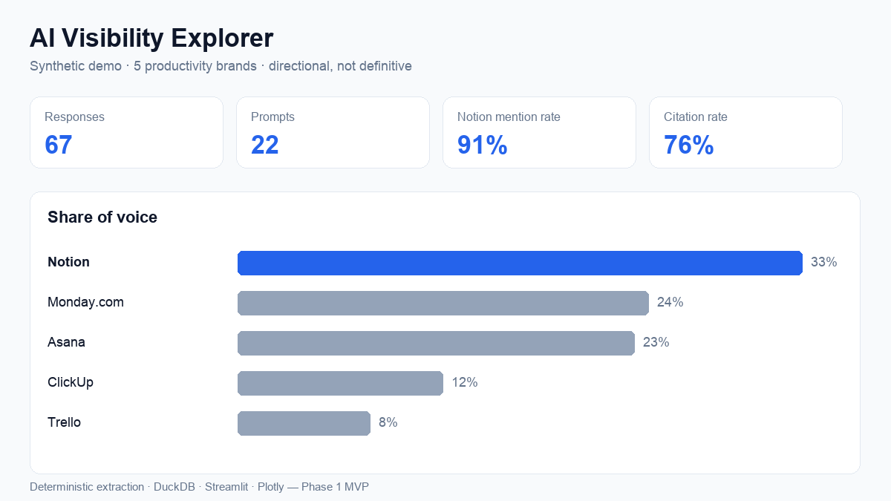

# 🔎 AI Visibility Explorer

Measure how a brand shows up across **AI-powered search answers** — how often it is
mentioned, how it compares with competitors, which sources get cited, where the content
gaps are, and **what to do next** — then export a plain-language readout a marketing or
customer-success team can act on.

> **Phase 1 MVP.** Deterministic, offline-first, and free to run. No paid APIs required.
> The bundled demo data is **synthetic** (generated by a script) and is clearly labelled
> as such — it is **not** real output from ChatGPT, Claude, Gemini, Perplexity, or any
> other platform.



---

## The problem

People increasingly ask AI assistants ("what's the best project management tool?")
instead of scrolling a search-results page. The AI answers a handful of brands, often
recommends one, and sometimes cites a few websites. For a brand, **being named — early,
and favourably — in those answers is the new visibility**. But that visibility is:

- **hard to see** (there's no ranking report),
- **noisy** (the same prompt can return different brands on different runs), and
- **easy to over-interpret** (one run is not a trend).

AI Visibility Explorer turns a set of AI responses into transparent, defensible metrics —
and is deliberately honest about their limits.

## Why AI-search visibility matters

- AI answers compress a whole results page into a short list. **Inclusion and order matter
  more than ever.**
- Third-party sources (review sites, roundups, forums) frequently shape which brands get
  recommended — so influence isn't only about your own website.
- Visibility shifts as models update and as content changes. **Measuring it repeatably**
  lets a team see whether their content work is paying off.

## Intended users

- **Marketing / SEO / content teams** wanting to understand and improve AI-search presence.
- **Customer-success / analyst teams** at a company like Scrunch producing customer-facing
  readouts.
- **Anyone** evaluating brand visibility across AI platforms who needs transparent,
  explainable numbers rather than a black box.

---

## Product workflow

1. **Create a project** — name it, set the industry.
2. **Add brands** (yours + competitors), with optional **aliases** (e.g. "Monday" → "Monday.com").
3. **Add prompts** and classify them by category, topic, persona, journey stage, and
   brand/non-brand.
4. **Add AI responses** — paste one at a time or **upload a CSV**. Choose the platform label
   and experiment date.
5. **Run extraction** — deterministic brand-mention + citation extraction (correct results by hand if needed).
6. **Explore the dashboard** — filter by brand, platform, category, topic, persona, stage, date.
7. **Read the customer readout** — a grounded, plain-language summary, exportable to Markdown.
8. **Check limitations** — a permanent section on confidence and caveats.

Optional: **Page Audit** inspects the public technical traits of cited pages (title, headings,
schema, freshness) — presented strictly as *associations, not causes*.

---

## Measurement framework & metric definitions

Every metric is a small, pure Python function in [`src/metrics.py`](src/metrics.py) with a
plain-language definition surfaced as a tooltip in the app (definitions are **never hidden**).

| # | Metric | Definition |
|---|--------|------------|
| 1 | **Brand mention rate** | Share of responses that mention a brand at least once. |
| 2 | **Share of voice** | A brand's mentions ÷ total mentions of all tracked brands. |
| 3 | **First mention share** | Among responses naming any tracked brand, the share where this brand appears first. |
| 4 | **Recommendation rate** | Share of responses that actively recommend a brand (transparent cue-word heuristic). |
| 5 | **Citation rate** | Share of responses that include at least one source URL. |
| 6 | **Source domain share** | For each cited website, its share of all citations. |
| 7 | **Prompt category performance** | Brand mention rate broken down by prompt category. |
| 8 | **Persona performance** | Brand mention rate broken down by target persona. |
| 9 | **Platform comparison** | Mention rate / share of voice by AI platform. |
| 10 | **Competitor visibility** | Leaderboard of mention rate + share of voice across brands. |
| 11 | **Content coverage gaps** | Topics where the focal brand trails the best competitor. |
| 12 | **Response consistency** | Stability across repeated runs of the same prompt. |

**Response consistency** uses simple, explainable measures — not heavy statistics a small
sample can't support:

- **Brand overlap** — mean pairwise Jaccard of the *sets of brands* mentioned across runs.
- **Recommendation agreement** — mean pairwise Jaccard of the *recommended* brand sets.
- **Citation domain overlap** — mean pairwise Jaccard of cited-domain sets.
- **Mention count variation** — coefficient of variation of total mentions per run.

---

## Technical architecture

```
┌────────────┐   CSV / paste   ┌──────────────┐   deterministic   ┌───────────────┐
│  Prompts   │───────────────▶ │  Response    │────extraction────▶│ brand_mentions│
│  Responses │                 │  runs (raw)  │   (regex + alias) │   citations   │
└────────────┘                 └──────────────┘                   └───────┬───────┘
                                                                          │
                          pandas DataFrames (source of truth)             │
                                          │                               │
                                          ▼                               ▼
                                   ┌──────────────┐   SQL       ┌────────────────────┐
                                   │   DuckDB     │◀───────────▶│  metrics.py (pure) │
                                   │ (analytics)  │             │  12 metrics + defs │
                                   └──────────────┘             └─────────┬──────────┘
                                                                          ▼
                                    Streamlit multipage UI  ◀──  recommendations.py (grounded readout)
                                    (Plotly charts, filters)      page_audit.py (optional web signals)
```

- **Python 3.11+** · **pandas** (data) · **DuckDB** (local SQL analytics) · **Streamlit**
  (UI) · **Plotly** (charts) · **requests + BeautifulSoup** (page audit) · **pytest** (tests).
- **CSV files / session DataFrames are the source of truth.** DuckDB is a fast SQL engine
  *over* them, so the `.duckdb` file is disposable and rebuilt on demand.
- **Extraction is pluggable** via an `Extractor` interface — deterministic by default, with a
  clear seam to add an LLM extractor later without touching metrics or UI.
- **No secrets in the repo.** Optional API keys load from `.env` (see `.env.example`).

### Data model

Tables / DuckDB views (see [`src/database.py`](src/database.py)):

`projects` · `brands` · `prompts` · `response_runs` · `brand_mentions` · `citations` ·
`page_audits` — with the exact columns documented in the module and mirrored in the schema DDL.

---

## How to run the project

### Option A — locally (recommended)

```bash
# 1. Clone and enter the project
git clone https://github.com/Likhithaa-Guntaka/ai-visibility-explorer.git
cd ai-visibility-explorer

# 2. Create and activate a virtual environment (isolates dependencies)
python3 -m venv .venv
source .venv/bin/activate          # macOS/Linux
# .venv\Scripts\activate           # Windows PowerShell

# 3. Install dependencies
pip install --upgrade pip
pip install -r requirements.txt

# 4. Launch the app
streamlit run app.py
```

Streamlit prints a **Local URL** (usually `http://localhost:8501`) — open it in your browser.
To stop the app, press `Ctrl+C` in the terminal. To leave the virtual environment, run `deactivate`.

### Option B — GitHub Codespaces (zero local setup)

1. On the GitHub repo page, click **`< > Code` → `Codespaces` → `Create codespace on main`**.
2. Wait for the container to build (it auto-installs `requirements.txt`).
3. In the Codespace terminal, run:
   ```bash
   streamlit run app.py --server.port 8501 --server.address 0.0.0.0
   ```
4. Click **Open in Browser** on the forwarded port **8501** popup.

### Run the tests

```bash
pytest            # 26 tests covering metrics + extraction
```

### Regenerate demo data or the preview image (optional)

```bash
python data/_generate_demo.py     # rebuilds the synthetic CSVs (deterministic)
python assets/_make_preview.py    # rebuilds assets/dashboard_preview.png
```

---

## Demo instructions

1. Launch the app and click **🚀 Load demo data** on the home page.
2. Open **Visibility Dashboard** — try the sidebar filters (platform, category, persona…).
3. Open **Citation Analysis** to see top source domains and brand-owned vs third-party split.
4. Open **Page Audit** (needs internet) to inspect cited pages.
5. Open **Customer Readout** and **⬇️ Download** the Markdown summary.
6. Read **Limitations & Confidence**.

---

## Key findings from the synthetic dataset

> These come from the **synthetic** demo (5 brands, 22 prompts, 67 fictional responses).
> They illustrate the kind of insight the tool surfaces — they are **not** real market data.

- **Notion leads visibility** — ~91% mention rate and ~33% share of voice, and is mentioned
  first in the majority of answers that name any tracked brand.
- **A "loud but not loved" gap exists.** In the demo, **Monday.com** has the **#2 share of
  voice (~24%)** but a **low recommendation rate (~15%)** — it gets *named* often but *picked*
  rarely. **Asana** shows the opposite pattern (lower share of voice, much higher
  recommendation rate). Share of voice alone would miss this.
- **Third-party sources matter.** Review/roundup domains (e.g. G2, Capterra, Zapier, Reddit)
  appear alongside brand-owned domains among the most-cited sources.
- **Results are noisy.** Across repeated runs of the same prompt, brand sets overlapped only
  ~60% on average — a strong reminder that a single run is not a conclusion.

## What a Marketing Team Could Do With These Insights

1. **Close comparison + purchase-intent gaps.** Create or strengthen content for the topics
   and categories where competitors out-appear you (the dashboard's *content coverage gaps*
   table ranks these directly).
2. **Turn "mentions" into "recommendations."** If you have high share of voice but a low
   recommendation rate (the Monday.com pattern), invest in proof — comparisons, outcomes,
   and use-case pages — so answers pick you, not just name you.
3. **Study the third-party sources that shape recommendations.** Identify the review sites,
   roundups, and forums that AI answers cite most, and prioritise presence and accuracy there.
4. **Improve pages that don't answer common questions.** Use the persona/topic breakdowns to
   spot audiences you're invisible to, and build content that directly answers their prompts.
5. **Track visibility after every content change.** Re-run the same prompt set on a schedule
   and watch mention rate, first-mention share, and recommendation rate move over time.

---

## Limitations and confidence

This is an **exploratory measurement tool**, not a definitive ranking system. The app has a
permanent **Limitations & Confidence** page that discusses: small sample sizes, prompt
selection bias, platform variability, model updates, personalization, missing citations,
incomplete source access, run-to-run differences, correlation vs. causation, and
non-representative prompt sets. Metrics based on very few responses are flagged in-app.
**Never present exploratory results as definitive conclusions.**

---

## Future improvements (Phase 2)

- **LLM-based extraction adapter** behind the existing `Extractor` interface (deterministic
  stays the default).
- **Official API adapters** (OpenAI / Anthropic / Gemini) to collect fresh responses when keys
  are present — never by scraping any product UI.
- **Optional AI narrative** for the readout, clearly labelled *AI-generated* and constrained to
  the computed metrics (no invented findings).
- **Statistical consistency** (bootstrapped confidence intervals) once sample sizes justify it.
- **Scheduled re-runs & trend tracking** to measure visibility change over time.
- **Persistence / multi-user** (auth, saved projects) and richer page-audit signals.

---

## Development Process

I used Claude Code as an AI-assisted development tool for implementation support, debugging, testing, and documentation. I defined the project problem, product scope, measurement framework, analytical requirements, workflow, and final decisions, and I reviewed and validated the completed application.

---

## Repository structure

```
ai-visibility-explorer/
├── app.py                     # Streamlit home page
├── pages/
│   ├── 1_Data_Input.py        # project, brands, prompts, responses, corrections
│   ├── 2_Visibility_Dashboard.py
│   ├── 3_Citation_Analysis.py
│   ├── 4_Page_Audit.py
│   ├── 5_Customer_Readout.py
│   └── 6_Limitations.py
├── src/
│   ├── database.py            # DuckDB layer + schema + AnalysisData
│   ├── extraction.py          # deterministic extraction (LLM-ready interface)
│   ├── metrics.py             # 12 metrics + definitions
│   ├── recommendations.py     # grounded, templated customer readout
│   ├── validation.py          # CSV/DataFrame validation
│   ├── page_audit.py          # optional public page inspection
│   ├── appkit.py              # session state, demo loading, filtering
│   └── ui.py                  # shared Streamlit filter widgets
├── data/
│   ├── demo_prompts.csv       # synthetic
│   ├── demo_responses.csv     # synthetic (clearly labelled)
│   └── _generate_demo.py      # deterministic demo generator
├── tests/
│   ├── test_metrics.py
│   └── test_extraction.py
├── assets/dashboard_preview.png
├── .devcontainer/devcontainer.json   # GitHub Codespaces
├── requirements.txt · .env.example · .gitignore · pytest.ini
```

---

## Responsible-use notes

- **Never scrape** ChatGPT, Claude, Gemini, or Perplexity user interfaces. Use pasted
  responses you collected yourself, or official APIs.
- **Synthetic data is labelled synthetic** everywhere it appears.
- **Page-audit traits are associations, not proven causes** of AI citations.
- **No secrets in the repo** — copy `.env.example` to `.env` for any optional keys.

_Built as a portfolio project. MIT-friendly; adapt freely._
